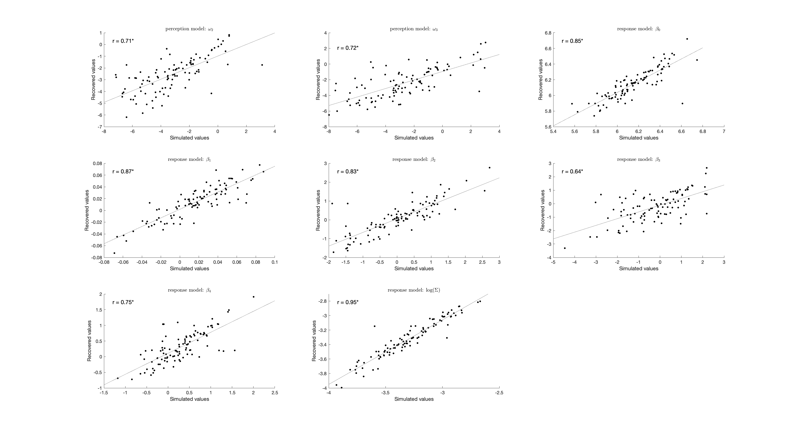
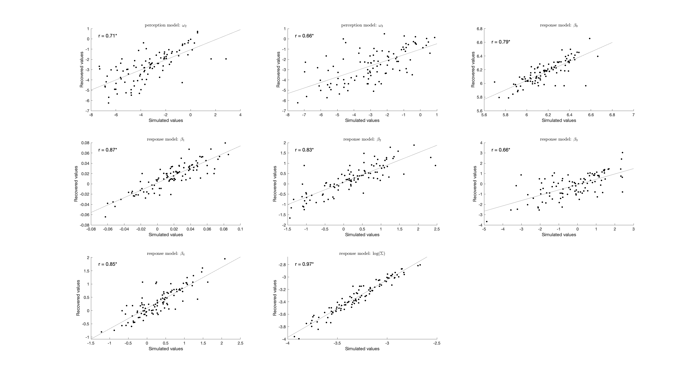
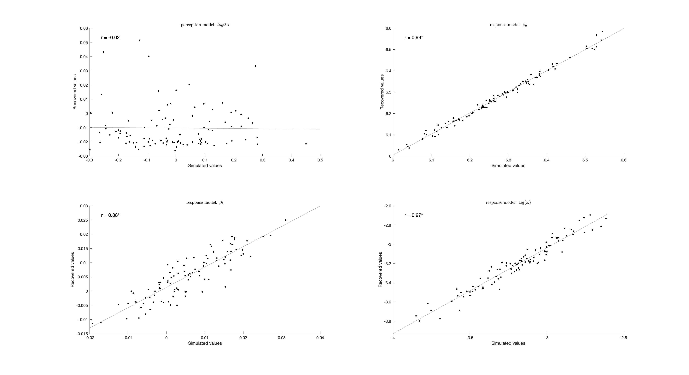
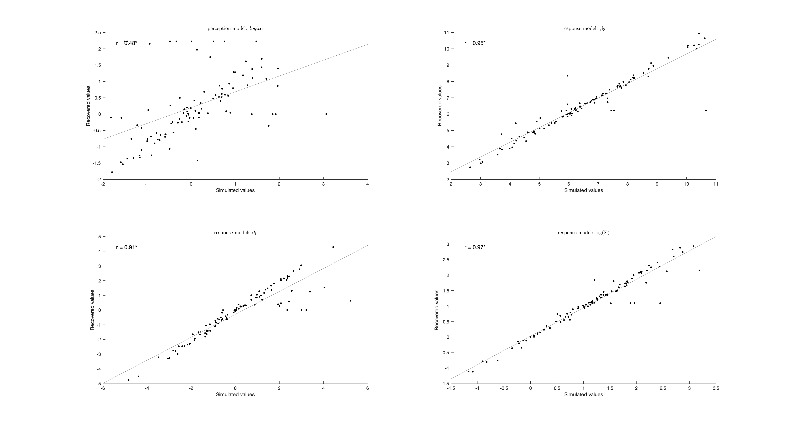
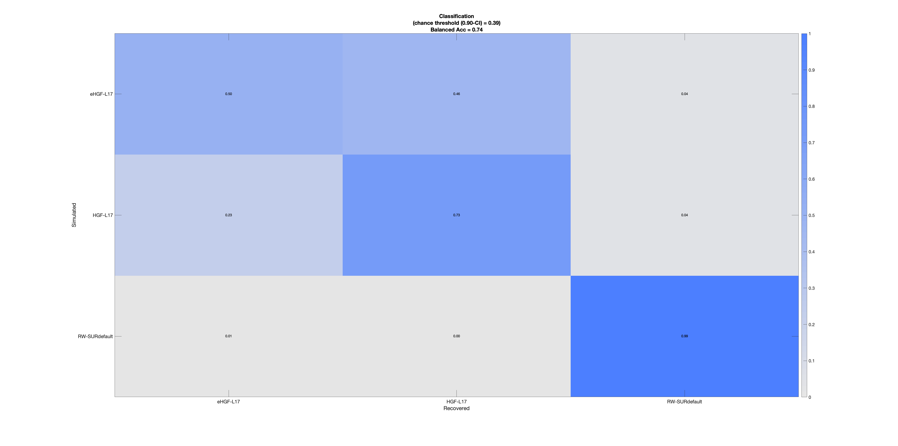
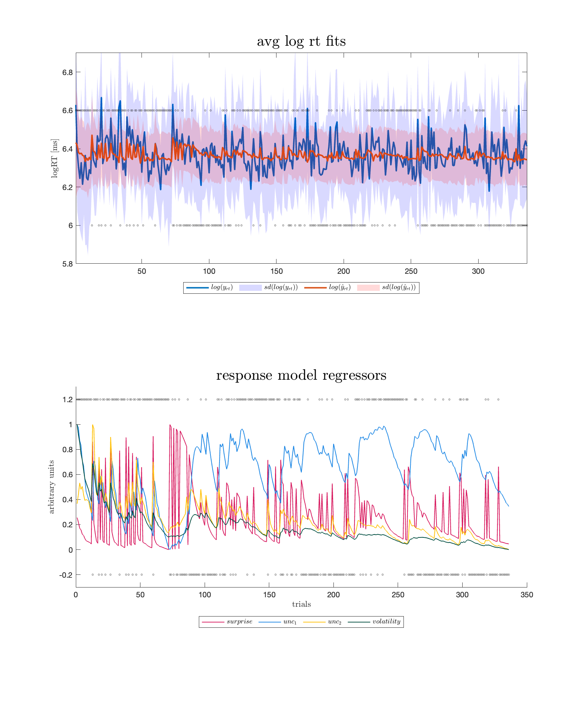

```{r setup, include=FALSE}

# clear global environment
rm(list=ls())

knitr::opts_chunk$set(echo = T, fig.pos = "center",
                      fig.width = 7.5, fig.height = 4, 
                      echo=FALSE, message=F)

ls.packages = c("knitr",# kable
    "ggplot2",          # plots
    "brms",             # Bayesian lmms
    "designr",          # simLMM
    "bridgesampling",   # bridge_sampler
    "tidyverse",        # tibble stuff
    "ggpubr",           # ggarrange
    "ggpattern",
    "ggrain",           # geom_rain
    "bayesplot",        # plots for posterior predictive checks
    "SBC",              # plots for checking computational faithfulness
    "rstatix",          # anova
    "BayesFactor", 
    "effectsize",
    "bayestestR"        # equivalence_test
)

lapply(ls.packages, library, character.only=TRUE)

# Setup caching of results
brms_dir = "./_brms_models"

# confidence interval functions
lower_ci = function(var) {
  unname(quantile(var, probs = 0.025))
}
upper_ci = function(var) {
  unname(quantile(var, probs = 0.975))
}

# scale function for vector
scale_this = function(x){
  (x - mean(x, na.rm=TRUE)) / sd(x, na.rm=TRUE)
}

# graph settings 
c_light = "#a9afb2"; c_light_highlight = "#8ea5b2"; c_mid = "#6b98b2" 
c_mid_highlight = "#3585b2"; c_dark = "#0072b2"; c_dark_highlight = "#0058b2" 
c_green = "#009E73"
sz = 1
a = 0.5

# custom colour palette
col.grp = c("#004D40", "#1E88E5")
col.cnd = c("#5D3A9B", "#E66100")
col = c("#40B0A6", "#E1BE6A")

# load in task data
load(file.path("../data", "PAL-ASD_data.RData"))

# load optimal Bayesian Observer parameters
df.bopars = read_csv(file.path("HGF_results", "rev", "BOpars.csv"))

# read in the subject information
df.sub = read_csv(file.path("../data", "PAL-sub.csv")) %>%
  filter(subID %in% unique(df.tsk$subID)) %>%
  mutate(gender = if_else(gender == "fem", "female", "male"))

# print the distribution of gender + cis/trans and diagnosis
kable(df.sub %>% group_by(gender, cis, diagnosis) %>% count())

# set the seed
set.seed(2468)

```

<style type="text/css">
  .main-container {
    max-width: 1100px;
    margin-left: auto;
    margin-right: auto;
  }
</style>

# Package versions

The following packages are used in this RMarkdown file: 
  
```{r lib_versions, echo=F}

print(R.Version()$version.string)

for (package in ls.packages) {
  print(sprintf("%s version %s", package, packageVersion(package)))
}

```

# Methods

## Preprocessing of pupil sizes

We classified any extreme values (above 8 and below 2mm) as well as participant-specific extreme velocities and blinks as artefacts. Then, we low-pass filtered the data with a threshold of 4Hz based on Kret and Sjak-Shie (2019), smoothed the data and interpolated all artefacts shorter than half a second with cubic spline interpolation. Next, data was downsampled to 100Hz and trials with more than one third of the datapoints missing were excluded from analysis. Last, we applied correction based on a baseline of 200ms before onset of the face presentation. We visualised data quality and excluded trials if the pupil trace indicates recording artefacts or baseline artefacts as well as if the baseline pupil size is considered an outlier (absolute z-score larger than 2). 

## Bayesian linear (mixed) models

All contrasts are set to sum coding. The models for the volatilities extracted from the HGF and for the pupil sizes used a Gaussian likelihood, while both the reaction times and learning rate updates were modelled using a lognormal distribution. The reaction time model additionally included a shift. All models included the predictor Group (ASD, COMP). The reaction time model also included Expectancy, Phase and Difficulty as well as all interactions on the population-level, and participant with slopes for Expectancy, Phase, Difficulty and their interactions as well as trials with slopes for Group on the group-level. The hypothesis regarding pupil sizes was evaluated using a model with the predictors Group, Expectancy and their interaction as well as intercepts for the participants on the group-level. Since pupil sizes are sensitive to physical movements (Mathôt & Vilotijević, 2023), we include RT of each trial instead of including trial on the group-level, as preregistered. The model for the learning rate updates included Group, Level (environmental or cue-outcome association) and Change (stable to volatile or volatile to stable) on the population-level as well as participants with slopes for Level and Change on the group-level. 

# Model evaluation

## Parameter recovery and model identifiability











## Posterior predictive checks for oHGF

```{r eval1, fig.height=6}

col = c("#40B0A6", "#E1BE6A")
sz  = 3

df.sim = read_csv(file.path("HGF_results", "main", "ppc_data_HGF-L17.csv")) %>% 
  group_by(subID, trl) %>%
  summarise(
    simulated = mean(exp(yhat))
  )

load("../data/PAL-ASD_data.RData")

df = merge(df.tsk, df.sim) %>%
  mutate(difficulty = if_else(difficulty == "difficult", "hard", difficulty),
         difficulty = factor(difficulty, levels = c("easy", "medium", "hard"))) %>%
  filter(expected != "neutral") %>% droplevels()

# expectancy
p1 = df %>% rename("data" = "rt.cor") %>% 
  pivot_longer(cols = c(data, simulated), names_to = "type") %>%
  group_by(subID, diagnosis, type, expected) %>%
  summarise(value = median(value, na.rm = T)) %>%
  group_by(diagnosis, type, expected) %>%
  summarise(
    rt.mn = mean(value),
    rt.se = sd(value)/sqrt(n())
  ) %>%
  ggplot(aes(y = rt.mn, x = expected, 
             group = type, colour = type)) +
  geom_line(position = position_dodge(0.4), linewidth = 1) +
  geom_errorbar(aes(ymin = rt.mn - rt.se, 
                    ymax = rt.mn + rt.se), linewidth = 1, width = 0.5, 
                position = position_dodge(0.4)) + 
  geom_point(position = position_dodge(0.4), size = sz) + 
  labs (x = "", y = "rt (ms)") +
  ylim(515, 665) + 
  scale_fill_manual(values = col) +
  scale_color_manual(values = col) +
  facet_wrap(. ~ diagnosis, nrow = 2) + 
  theme_bw() + 
  theme(legend.position.inside = c(0.5, 0.6), 
        legend.position = "inside", legend.direction = "horizontal",
        legend.title = element_blank(),
        plot.title = element_text(hjust = 0.5))

# difficulty
p2 = df %>% rename("data" = "rt.cor") %>% 
  pivot_longer(cols = c(data, simulated), names_to = "type") %>%
  group_by(subID, diagnosis, type, difficulty) %>%
  summarise(value = median(value, na.rm = T)) %>%
  group_by(diagnosis, type, difficulty) %>%
  summarise(
    rt.mn = mean(value),
    rt.se = sd(value)/sqrt(n())
  ) %>%
  ggplot(aes(y = rt.mn, x = difficulty, 
             group = type, colour = type)) +
  geom_line(position = position_dodge(0.4), linewidth = 1) +
  geom_errorbar(aes(ymin = rt.mn - rt.se, 
                    ymax = rt.mn + rt.se), linewidth = 1, width = 0.5, 
                position = position_dodge(0.4)) + 
  geom_point(position = position_dodge(0.4), size = sz) + 
  ylim(515, 665) + 
  labs (x = "", y = "") + 
  facet_wrap(. ~ diagnosis, nrow = 2) + 
  scale_fill_manual(values = col) +
  scale_color_manual(values = col) +
  theme_bw() + 
  theme(legend.position = "none", plot.title = element_text(hjust = 0.5))


# phase
p3 = df %>% rename("data" = "rt.cor") %>% 
  pivot_longer(cols = c(data, simulated), names_to = "type") %>%
  group_by(subID, diagnosis, type, phase) %>%
  summarise(value = median(value, na.rm = T)) %>%
  group_by(diagnosis, type, phase) %>%
  summarise(
    rt.mn = mean(value),
    rt.se = sd(value)/sqrt(n())
  ) %>%
  ggplot(aes(y = rt.mn, x = phase, 
             group = type, colour = type)) +
  geom_line(position = position_dodge(0.4), linewidth = 1) +
  geom_errorbar(aes(ymin = rt.mn - rt.se, 
                    ymax = rt.mn + rt.se), linewidth = 1, width = 0.5, 
                position = position_dodge(0.4)) + 
  geom_point(position = position_dodge(0.4), size = sz) + 
  labs (x = "", y = "") + 
  ylim(515, 665) + 
  facet_wrap(. ~ diagnosis, nrow = 2) + 
  scale_fill_manual(values = col) +
  scale_color_manual(values = col) +
  theme_bw() + 
  theme(legend.position = "none", plot.title = element_text(hjust = 0.5))


p = ggarrange(p1, p2, p3, 
              nrow = 1, ncol = 3)
annotate_figure(p, top = text_grob("Posterior predictive checks: HGF", 
                                   face = "bold", size = 14))

```
\newpage

\newpage

## Comparison of LME across groups

```{r eval2}

aov = readRDS(file.path(brms_dir, "aov_lme.rds"))

aov@denominator

kable(aov@bayesFactor)

```


# Volatility parameters and learning rate updates

## Phasic volatility

```{r hgf1}

m = readRDS(file.path(brms_dir, "m_hgf_vol.rds"))

summary(m)

```

## Environmental tonic volatility

```{r hgf2}

m = readRDS(file.path(brms_dir, "m_hgf_om3.rds"))

summary(m)

```

## Bernoulli model with HGF parameters


```{r hgf3}

m = readRDS(file.path(brms_dir, "m_hgf_bern.rds"))

summary(m)

```

## Learning rate updates

```{r hgf4}

m = readRDS(file.path(brms_dir, "m_hgf_alpha.rds"))

summary(m)

```

### Posterior predictive checks

```{r hgf5, fig.height=6}

# get posterior predictions
post.pred = posterior_predict(m, ndraws = 500)

# check the fit of the predicted data compared to the real data
p1 = pp_check(m, ndraws = 500) + 
  theme_bw() + theme(legend.position = "none") + xlim(0, 0.50)

# distributions of means compared to the real values per group
p2 = ppc_stat_grouped(m$data$value, post.pred, m$data$diagnosis) + 
  theme_bw() + theme(legend.position = "none")
p3 = ppc_stat_grouped(m$data$value, post.pred, m$data$level) + 
  theme_bw() + theme(legend.position = "none")
p4 = ppc_stat_grouped(m$data$value, post.pred, m$data$change) + 
  theme_bw() + theme(legend.position = "none")

p = ggarrange(p1, p2, p3, p4,
          nrow = 4, ncol = 1)
annotate_figure(p, top = text_grob("Posterior predictive checks", 
                                   face = "bold", size = 14))

```

### ANOVA of ranked learning rate updates

```{r hgf6}

aov = readRDS(file.path(brms_dir, "aov_alpha.rds"))

aov@denominator

kable(aov@bayesFactor %>% select(bf) %>% arrange(desc(bf)))

```

# Reaction times, pupil sizes and accuracies

## Reaction times

```{r rt}

m = readRDS(file.path(brms_dir, "m_pal.rds"))

summary(m)

```

```{r plot_rt, fig.height=10}

# rain cloud plot including all factors

m$data %>%
  ggplot(aes(diagnosis, rt.cor, fill = expected, colour = expected)) + #
  geom_rain(rain.side = 'r',
boxplot.args = list(color = "black", outlier.shape = NA, show.legend = FALSE, alpha = .8),
violin.args = list(color = "black", outlier.shape = NA, alpha = .8),
boxplot.args.pos = list(
  position = ggpp::position_dodgenudge(x = 0, width = 0.3), width = 0.3
),
point.args = list(show.legend = FALSE, alpha = .5),
violin.args.pos = list(
  width = 0.6, position = position_nudge(x = 0.16)),
point.args.pos = list(position = ggpp::position_dodgenudge(x = -0.25, width = 0.1))) +
  scale_fill_manual(values = col.cnd) +
  scale_color_manual(values = col.cnd) +
  #ylim(0, 1) +
  labs(title = "Reaction times per subject", x = "", y = "rt (ms)") +
  facet_wrap(difficulty ~ phase) +
  theme_bw() + 
  theme(legend.position = "bottom", plot.title = element_text(hjust = 0.5), 
        legend.direction = "horizontal", text = element_text(size = 15))

```

## Pupil sizes

```{r pup}

m = readRDS(file.path(brms_dir, "m_pup.rds"))

summary(m)

```


```{r plot_pup, fig.height=4}

# rain cloud plot
m$data %>%
  group_by(subID, diagnosis, expected) %>%
  summarise(
    rel_pupil = mean(rel_pupil)
  ) %>%
  ggplot(aes(diagnosis, rel_pupil, fill = expected, colour = expected)) + #
  geom_rain(rain.side = 'r',
boxplot.args = list(color = "black", outlier.shape = NA, show.legend = FALSE, alpha = .8),
violin.args = list(color = "black", outlier.shape = NA, alpha = .8),
boxplot.args.pos = list(
  position = ggpp::position_dodgenudge(x = 0, width = 0.3), width = 0.3
),
point.args = list(show.legend = FALSE, alpha = .5),
violin.args.pos = list(
  width = 0.6, position = position_nudge(x = 0.16)),
point.args.pos = list(position = ggpp::position_dodgenudge(x = -0.25, width = 0.1))) +
  scale_fill_manual(values = col.cnd) +
  scale_color_manual(values = col.cnd) +
  labs(title = "", x = "", y = "pupil size change (mm)") +
  theme_bw() + 
  theme(legend.position = "bottom", plot.title = element_blank(),
        legend.direction = "horizontal", text = element_text(size = 15), 
        legend.title = element_blank())

```


## Accuracies

```{r acc}

aov = readRDS(file.path(brms_dir, "aov_acc.rds"))

aov@denominator

kable(aov@bayesFactor %>% select(bf) %>% arrange(desc(bf)),
      digits = 2)

```


```{r plot_acc, fig.height=10}

# rain cloud plot including all factors

aov@data %>%
  ggplot(aes(expected, acc, fill = diagnosis, colour = diagnosis)) + #
  geom_rain(rain.side = 'r',
boxplot.args = list(color = "black", outlier.shape = NA, show.legend = FALSE, alpha = .8),
violin.args = list(color = "black", outlier.shape = NA, alpha = .8),
boxplot.args.pos = list(
  position = ggpp::position_dodgenudge(x = 0, width = 0.3), width = 0.3
),
point.args = list(show.legend = FALSE, alpha = .5),
violin.args.pos = list(
  width = 0.6, position = position_nudge(x = 0.16)),
point.args.pos = list(position = ggpp::position_dodgenudge(x = -0.25, width = 0.1))) +
  scale_fill_manual(values = col.grp) +
  scale_color_manual(values = col.grp) +
  labs(title = "Accuracies per subject", x = "", y = "accuracy (%)") +
  facet_wrap(phase ~ difficulty) +
  theme_bw() + 
  theme(legend.position = "bottom", plot.title = element_text(hjust = 0.5), 
        legend.direction = "horizontal", text = element_text(size = 15))

```

# Learning rates proper

```{r lr, fig.height=8}

# load optimal Bayesian Observer parameters
df.bopars = merge(read_csv(file.path("HGF_results", "rev", "BOpars.csv")),
                  df.tsk %>% select(trl, phase) %>% distinct())

df.bopars.agg = df.bopars %>%
  group_by(phase) %>%
  summarise(across(starts_with("alpha"),
                   .fns = list(median))) %>%
  pivot_longer(cols = starts_with("alpha"), values_to = "median") %>%
  mutate(level = gsub("_opt_1", "", name))

# plot of BOpar and subject learning rates
merge(read_csv(file.path("HGF_results/main", "HGF-L17_traj.csv")),
      read_csv(file.path("../data", "PAL-sub_ASD.csv"))) %>%
  merge(., df.tsk %>% select(trl, phase) %>% distinct()) %>%
  group_by(subID, diagnosis, phase) %>%
  summarise(across(starts_with("alpha"), mean)) %>%
  pivot_longer(cols = starts_with("alpha"), names_to = "level") %>% 
  ggplot(aes(diagnosis, value)) +
  geom_boxplot(aes(fill = diagnosis)) +
  scale_fill_manual(values = col.grp) + 
  scale_color_manual(values = col.grp) +
  facet_grid(level ~ phase, scales = "free") +
  geom_hline(data = df.bopars.agg, aes(yintercept = median)) + 
  labs(title = "Learning rates", x = "", y = "") +
  theme_bw() + 
  theme(legend.position = "bottom", plot.title = element_text(hjust = 0.5), 
        legend.direction = "horizontal", text = element_text(size = 15))

```

# Handedness and button assignment

We counterbalanced whether the left or the right button was to be clicked to indicate a positive valence. Here, we check whether there were any differences between groups in terms of handedness and button assignment. Information on handedness of one participant is missing, because they skipped this question. 

```{r button}

# compare handedness frequencies across groups
tb.hand = xtabs(~ handedness + diagnosis, data = df.sub)
ct.hand = contingencyTableBF(tb.hand, 
                             sampleType = "indepMulti", 
                             fixedMargin = "cols")
ct.hand@bayesFactor

# print handedness x group
kable(df.sub %>% group_by(diagnosis, handedness) %>% count())

# print handedness, group x button assignment
kable(df.sub %>% group_by(diagnosis, PAL.pos, handedness) %>% count())

```
  
# Comparison of learning rate with BOpars

```{r bopar}

# get belief state trajectories
df.trj = merge(read_csv(file.path("HGF_results/main", "HGF-L17_traj.csv")),
               df.sub %>% select(subID, gender, diagnosis))

# calculate optimal learning rate updates based on BOpars
df.bopars.upd = df.bopars %>% 
  mutate(
    trl = row_number(),
    phase = case_when(
      trl < 73  ~ "pre",
      trl > 264 ~ "post",
      trl < 145 ~ "vol1",
      trl > 192 ~ "vol2"
    )
  ) %>% drop_na() %>%
  group_by(phase) %>%
  summarise(
    alpha2 = median(alpha2_opt),
    alpha3 = median(alpha3_opt)
  ) %>% 
  pivot_wider(names_from = phase, values_from = starts_with("alpha")) %>%
  transmute(
    alpha2_pre2vol  = abs(alpha2_pre  - alpha2_vol1),
    alpha2_vol2post = abs(alpha2_post - alpha2_vol2),
    alpha3_pre2vol  = abs(alpha3_pre  - alpha3_vol1),
    alpha3_vol2post = abs(alpha3_post - alpha3_vol2)
  ) %>% 
  pivot_longer(cols = starts_with("alpha")) %>%
  separate(name, into = c("level", "change")) %>%
  mutate(
    change = case_match(change,
                        "pre2vol"  ~ "prevolatile to volatile",
                        "vol2post" ~ "volatile to postvolatile"),
    level = case_match(level,
                        "alpha2"  ~ "2nd level learning rate updates",
                        "alpha3"  ~ "3rd level learning rate updates")
  )
kable(df.bopars.upd, 
  digits = 3)

# extract the absolute changes in learning rate for the phases
df.upd = df.trj %>%
  select(subID, gender, diagnosis, trl, alpha2, alpha3) %>%
  mutate(
    phase = case_when(
      trl < 73  ~ "pre",
      trl > 264 ~ "post",
      trl < 145 ~ "vol1",
      trl > 192 ~ "vol2"
    )
  ) %>%
  drop_na() %>%
  group_by(subID, diagnosis, gender, phase) %>%
  summarise(
    alpha2 = median(alpha2),
    alpha3 = median(alpha3)
  ) %>%
  pivot_wider(names_from = phase, id_cols = c(subID, diagnosis, gender), values_from = starts_with("alpha")) %>%
  group_by(subID, diagnosis, gender) %>%
  summarise(
    alpha2_pre2vol  = abs(alpha2_pre  - alpha2_vol1),
    alpha2_vol2post = abs(alpha2_post - alpha2_vol2),
    alpha3_pre2vol  = abs(alpha3_pre  - alpha3_vol1),
    alpha3_vol2post = abs(alpha3_post - alpha3_vol2)
  ) %>% 
  pivot_longer(cols = starts_with("alpha")) %>%
  separate(name, into = c("level", "change")) %>%
  mutate_if(is.character, as.factor) 

# create the plot again but with lines for BOpars
p = df.upd %>%
  mutate(
    change = case_match(change,
                        "pre2vol"  ~ "prevolatile to volatile",
                        "vol2post" ~ "volatile to postvolatile"),
    level = case_match(level,
                        "alpha2"  ~ "2nd level learning rate updates",
                        "alpha3"  ~ "3rd level learning rate updates")
  ) %>%
  ggplot(aes(1, value, fill = diagnosis, colour = diagnosis)) + #
  geom_rain(rain.side = 'r',
boxplot.args = list(color = "black", outlier.shape = NA, show.legend = FALSE, alpha = .8),
violin.args = list(color = "black", outlier.shape = NA, alpha = .8),
boxplot.args.pos = list(
  position = ggpp::position_dodgenudge(x = 0, width = 0.3), width = 0.3
),
point.args = list(show.legend = FALSE, alpha = .5),
violin.args.pos = list(
  width = 0.6, position = position_nudge(x = 0.16)),
point.args.pos = list(position = ggpp::position_dodgenudge(x = -0.25, width = 0.1))) +
  scale_fill_manual(values = col.grp) +
  scale_color_manual(values = col.grp) +
  facet_wrap(level ~ change, scales = "free") +
  geom_hline(data = df.bopars.upd, aes(yintercept = value)) + 
  labs(title = "Learning rate updates", x = "", y = "") +
  theme_bw() + 
  theme(legend.position = "bottom", plot.title = element_blank(), 
        legend.direction = "horizontal", text = element_text(size = 13),
        axis.text.x = element_blank(), axis.ticks.x = element_blank())

ggsave("plots/FigHGF_LR-rev.svg", plot = p, units = "cm", width = 27, height = 13.5)

```

# Posterior predictive checks

```{r ppc}

df.sim = read_csv(file.path("HGF_results", "main", "ppc_data_HGF-L17.csv")) %>% 
  mutate(
    simulated = exp(yhat)
  )

load("../data/PAL-ASD_data.RData")

df = merge(df.tsk, df.sim) %>%
  mutate(difficulty = if_else(difficulty == "difficult", "hard", difficulty),
         difficulty = factor(difficulty, levels = c("easy", "medium", "hard")))

df = df %>%
  filter(expected != "neutral") %>% droplevels() %>% 
  group_by(subID, diagnosis, phase, expected, difficulty, trl) %>%
  summarise(
    rt.cor    = mean(rt.cor),
    simulated = mean(exp(yhat))
  )

# expectancy effect as line plot
p1 = df %>% 
  group_by(subID, diagnosis, phase, expected) %>%
  summarise(rt.sim = median(simulated, na.rm = T),
            rt.cor = median(rt.cor, na.rm = T)) %>%
  group_by(subID, diagnosis, phase) %>%
  summarise(sim  = diff(rt.sim), 
            real = diff(rt.cor)) %>%
  pivot_longer(cols = c(sim, real), values_to = "rt", names_to = "type") %>%
  group_by(diagnosis, phase, type) %>%
  summarise(
    rt.mn = mean(rt),
    rt.se = sd(rt)
  ) %>%
  ggplot(aes(y = rt.mn, x = phase, 
             group = type, colour = type)) +
  geom_line(position = position_dodge(0.4), linewidth = 1) +
  geom_errorbar(aes(ymin = rt.mn - rt.se, 
                    ymax = rt.mn + rt.se), linewidth = 1, width = 0.5, 
                position = position_dodge(0.4)) + 
  geom_point(position = position_dodge(0.4), size = 5) + 
  labs (x = "phase", y = "rt difference (ms)") + 
  ggtitle("Expectancy effect") + 
  facet_wrap(. ~ diagnosis) +
  scale_fill_manual(values = col) +
  scale_color_manual(values = col) +
  geom_hline(yintercept = 0) +
  theme_bw()  + 
  theme(legend.position = "inside", legend.position.inside = c(0.90, 0.75),
        axis.title.x = element_blank(), legend.title = element_blank(),
        legend.direction = "horizontal",
        plot.title = element_text(hjust = 0.5), text = element_text(size = 13))

# do the same for difficulty effects
p2 = df %>% filter(difficulty != "medium") %>%
  group_by(subID, diagnosis, phase, difficulty) %>%
  summarise(rt.sim = median(simulated, na.rm = T),
            rt.cor = median(rt.cor, na.rm = T)) %>%
  group_by(subID, diagnosis, phase) %>%
  summarise(sim  = diff(rt.sim), 
            real = diff(rt.cor)) %>%
  pivot_longer(cols = c(sim, real), values_to = "rt", names_to = "type") %>%
  group_by(diagnosis, phase, type) %>%
  summarise(
    rt.mn = mean(rt),
    rt.se = sd(rt)
  ) %>%
  ggplot(aes(y = rt.mn, x = phase, 
             group = type, colour = type)) +
  geom_line(position = position_dodge(0.4), linewidth = 1) +
  geom_errorbar(aes(ymin = rt.mn - rt.se, 
                    ymax = rt.mn + rt.se), linewidth = 1, width = 0.5, 
                position = position_dodge(0.4)) + 
  geom_point(position = position_dodge(0.4), size = 5) + 
  labs (x = "phase", y = "rt difference (ms)") + 
  ggtitle("Difficulty effect") + 
  facet_wrap(. ~ diagnosis) +
  scale_fill_manual(values = col) +
  scale_color_manual(values = col) +
  theme_bw()  + 
  geom_hline(yintercept = 0) +
  theme(legend.position = "none", axis.title.x = element_blank(),
        text = element_text(size = 13), plot.title = element_text(hjust = 0.5))

p = ggarrange(p1, p2, nrow = 2, ncol = 1)
ggsave("plots/FigPPC.svg", plot = p, units = "cm", width = 27, height = 13.5)


```


```{r overlap}

m.real = readRDS(file.path("./_brms_models", "m_pal.rds"))

if (!file.exists(file.path("./_brms_models", "m_pal-sim.rds"))) {
  m.sim  = update(m.real, newdata = df %>% mutate(rt.cor = simulated))
  saveRDS(m.sim, file.path("./_brms_models", "m_pal-sim.rds"))
} else {
  m.sim = readRDS(file.path("./_brms_models", "m_pal-sim.rds"))
}

df.post.sim  = as_draws_df(m.sim,  .nchains = 4) %>% 
  select(starts_with("b_") & !starts_with("b_Intercept"))
df.post.real = as_draws_df(m.real, .nchains = 4) %>% 
  select(starts_with("b_") & !starts_with("b_Intercept"))

# loop through all effects
ov = c()
effects = colnames(df.post.real)
for (effect in effects) {
  ov = c(ov, overlapping::overlap(list(df.post.real[[effect]],df.post.sim[[effect]]))$OV)
}

df.ov = data.frame(effects, ov)

kable(df.ov %>% arrange(desc(ov)))

kable(df.ov %>% 
        mutate(ov = ov*100) %>%
        summarise(
          mean    = mean(ov),
          sd      = sd(ov),
          ci.low  = quantile(ov, probs = 0.025, names = F),
          ci.high = quantile(ov, probs = 0.975, names = F)
        ), digits = 2, caption = "Summary of all estimate overlap values")

kable(df.ov %>% filter(grepl("diagnosis", effects)) %>%
        mutate(ov = ov*100) %>%
        summarise(
          mean    = mean(ov),
          sd      = sd(ov),
          ci.low  = quantile(ov, probs = 0.025, names = F),
          ci.high = quantile(ov, probs = 0.975, names = F)
        ), digits = 2, caption = "Summary of estimate overlap values pertaining to groups")

```

# Exploration of gender differences

## Reaction times: expectancy effect

```{r rt_gen, fig.height=4}

df.tsk = merge(df.tsk,
  df.sub %>%
    select(subID, diagnosis, gender))

df.tsk %>%
  filter(expected != "neutral") %>%
  group_by(subID, diagnosis, gender, phase, expected) %>%
  summarise(
    rt.md = median(rt.cor, na.rm = T)
  ) %>%
  pivot_wider(values_from = rt.md, names_from = expected) %>%
  mutate(
    rt.exp = unexpected - expected
  ) %>% ungroup() %>%
  mutate_if(is.character, as.factor) %>%
  ggplot(., aes(x = phase, y = rt.exp)) +
  geom_boxplot_pattern(pattern_density = 0.5, aes(fill = diagnosis, pattern = gender)) +
  scale_pattern_manual(values = c("female" = "none", "male" = "stripe")) + 
  scale_fill_manual(values = col.grp, guide = guide_legend(override.aes = list(pattern = 'none'))) +
  scale_color_manual(values = col.grp) +
  labs(title = "", x = "", y = "rt diff (ms)") +
  theme_bw() + 
  theme(legend.position = "bottom", plot.title = element_blank(), 
        legend.direction = "horizontal", text = element_text(size = 15))


```

## HGF parameters

```{r exp_setup}

df.hgf = merge(df.sub, read_csv(file.path("HGF_results/main", "HGF-L17_results.csv"))) %>%
  mutate_if(is.character, as.factor)

# set and print the contrasts
contrasts(df.hgf$diagnosis) = contr.sum(2)
contrasts(df.hgf$diagnosis)
contrasts(df.hgf$gender) = contr.sum(2)
contrasts(df.hgf$gender)


# set number of iterations and warmup for models
iter = 3000
warm = 1000

# model directory
brms_dir = "./_brms_models"


```

### Phasic environmental volatility

```{r hgf_vol, fig.height=4}

# model formula
f.vol = brms::bf( be4 ~ diagnosis * gender )

# set weakly informative priors
priors = c(
  prior(normal(0, 4),  class = Intercept),
  prior(normal(0, 0.50),  class = sigma),
  prior(normal(0, 0.25),  class = b)
)

# change Intercept based on empirical priors used in the HGF model
priors = priors %>%
  mutate(
    prior = if_else(
      class == "Intercept", 
      gsub("\\(.*,", paste0("(", mean(df.hgf$be4mu), ", "), prior), prior),
    prior = if_else(
      class == "Intercept", 
      gsub(" .*\\)", paste0(" ", mean(df.hgf$be4sa), ")"), prior), prior)
  )

# fit the model
m.vol = brm(f.vol, seed = 8822,
            df.hgf, prior = priors,
            iter = iter, warmup = warm,
            backend = "cmdstanr", threads = threading(2),
            file = file.path(brms_dir, "m_hgf_vol-gen"),
            save_pars = save_pars(all = TRUE)
            )
rstan::check_hmc_diagnostics(m.vol$fit)

# check that rhats are below 1.01
sum(brms::rhat(m.vol) >= 1.01, na.rm = T)

# check the trace plots
post.draws = as_draws_df(m.vol)
mcmc_trace(post.draws, regex_pars = "^b_",
           facet_args = list(ncol = 2)) +
  scale_x_continuous(breaks=scales::pretty_breaks(n = 3)) +
  scale_y_continuous(breaks=scales::pretty_breaks(n = 3))

# print the model
summary(m.vol)

```

### Tonic environmental volatility

```{r hgf_om3, fig.height=4}

# model formula
f.om3 = brms::bf( om3 ~ diagnosis * gender )

# change Intercept based on empirical priors used in the HGF model
priors = priors %>%
  mutate(
    prior = if_else(
      class == "Intercept", 
      gsub("\\(.*,", paste0("(", mean(df.hgf$om3mu), ", "), prior), prior),
    prior = if_else(
      class == "Intercept", 
      gsub(" .*\\)", paste0(" ", mean(df.hgf$om3sa), ")"), prior), prior)
  )

# fit the final model
m.om3 = brm(f.om3, seed = 2288,
            df.hgf, prior = priors,
            iter = iter, warmup = warm,
            backend = "cmdstanr", threads = threading(2),
            file = file.path(brms_dir, "m_hgf_om3-gen"),
            save_pars = save_pars(all = TRUE)
            )
rstan::check_hmc_diagnostics(m.om3$fit)

# check that rhats are below 1.01
sum(brms::rhat(m.om3) >= 1.01, na.rm = T)

# check the trace plots
post.draws = as_draws_df(m.om3)
mcmc_trace(post.draws, regex_pars = "^b_",
           facet_args = list(ncol = 2)) +
  scale_x_continuous(breaks=scales::pretty_breaks(n = 3)) +
  scale_y_continuous(breaks=scales::pretty_breaks(n = 3))

# print the model
summary(m.om3)

```

### Plot of all HGF parameters

```{r hgf, fig.height=6}

df.hgf %>%
  select(subID, gender, diagnosis, be0, be1, be2, be3, be4, ze, om2, om3) %>% #
  pivot_longer(cols = c(be0, be1, be2, be3, be4, ze, om2, om3), 
               names_to = "parameter") %>%
  mutate(
    parameter = factor(case_match(parameter,
                           "be0" ~ "predicted log RT",
                           "be1" ~ "stimulus surprise",
                           "be2" ~ "stimulus uncertainty",
                           "be3" ~ "cue-outcome uncertainty",
                           "be4" ~ "phasic volatility",
                           "ze"  ~ "Sigma (decision noise)",
                           "om2" ~ "2nd tonic volatility",
                           "om3" ~ "3rd tonic volatility"
                           ), levels = c("2nd tonic volatility", 
                                         "3rd tonic volatility", 
                                         "predicted log RT", 
                                         "stimulus surprise", 
                                         "stimulus uncertainty",
                                         "cue-outcome uncertainty", 
                                         "phasic volatility", 
                                         "Sigma (decision noise)"))
  ) %>%
  filter(!(parameter %in% c("predicted log RT", "Sigma (decision noise)"))) %>%
  ggplot(aes(x = diagnosis, y = value)) +
  geom_boxplot_pattern(pattern_density = 0.5, aes(fill = diagnosis, pattern = gender)) +
  scale_pattern_manual(values = c("female" = "none", "male" = "stripe")) + 
  scale_fill_manual(values = col.grp, guide = guide_legend(override.aes = list(pattern = 'none'))) +
  scale_color_manual(values = col.grp) +
  facet_wrap(. ~ parameter, scales = "free", ncol = 3) +
  labs(title = "HGF parameter", x = "", y = "") +
  theme_bw() + 
  theme(legend.position = "bottom", plot.title = element_blank(), 
        legend.direction = "horizontal", text = element_text(size = 15))


```

## Learning rate updates


```{r alpha_aov}

df.upd = df.upd %>% ungroup() %>%
  mutate(rvalue = rank(value)) %>%
  mutate_if(is.character, as.factor)

if (!file.exists(file.path(brms_dir, "aov_alpha-gen.rds"))) {
  aov = anovaBF(rvalue ~ gender * diagnosis * level * change, data = df.upd)
  saveRDS(aov, file.path(brms_dir, "aov_alpha-gen.rds"))
} else {
  aov = readRDS(file.path(brms_dir, "aov_alpha-gen.rds"))
}

kable(head(aov@bayesFactor %>% arrange(desc(bf)) %>%
  select(bf) %>% mutate(bf.diff = abs(lead(bf)-bf),
                        bf.int  = interpret_bf(bf.diff, log = T))), digits = 3)

```

```{r alpha, fig.height=8}

df.upd %>%
  mutate(
    change = case_match(change,
                        "pre2vol"  ~ "prevolatile to volatile",
                        "vol2post" ~ "volatile to postvolatile"),
    level = case_match(level,
                        "alpha2"  ~ "2nd level learning rate updates",
                        "alpha3"  ~ "3rd level learning rate updates")
  ) %>%
  ggplot(aes(diagnosis, value)) +
  geom_boxplot_pattern(pattern_density = 0.5, aes(fill = diagnosis, pattern = gender)) +
  scale_pattern_manual(values = c("female" = "none", "male" = "stripe")) + 
  scale_fill_manual(values = col.grp, guide = guide_legend(override.aes = list(pattern = 'none'))) + 
  scale_color_manual(values = col.grp) +
  facet_wrap(level ~ change, scales = "free") +
  labs(title = "Learning rate updates", x = "", y = "") +
  theme_bw() + 
  theme(legend.position = "bottom", plot.title = element_blank(), 
        legend.direction = "horizontal", text = element_text(size = 15))

```
